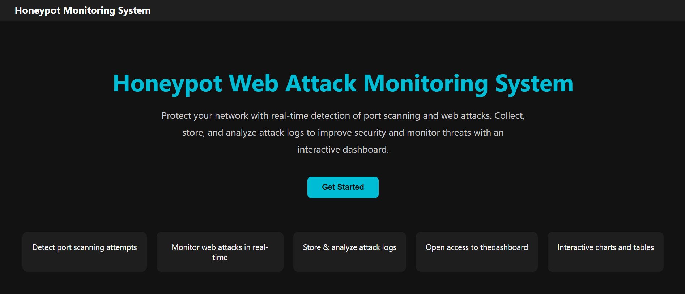
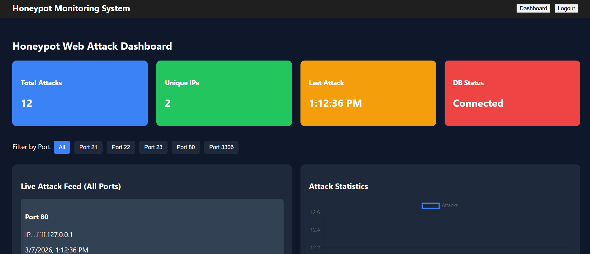
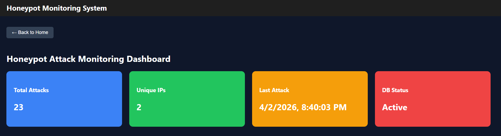
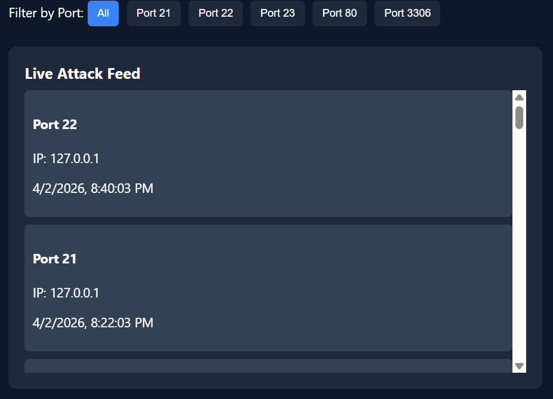
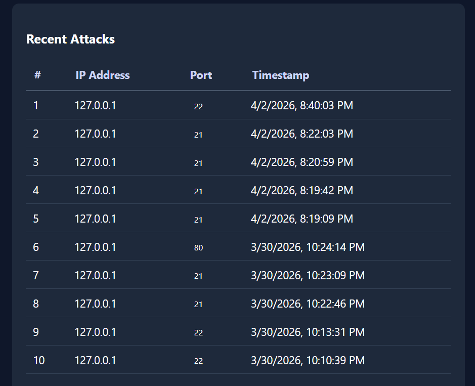
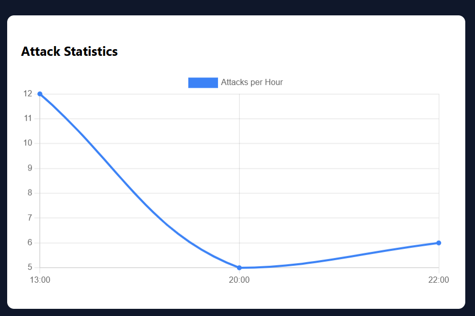
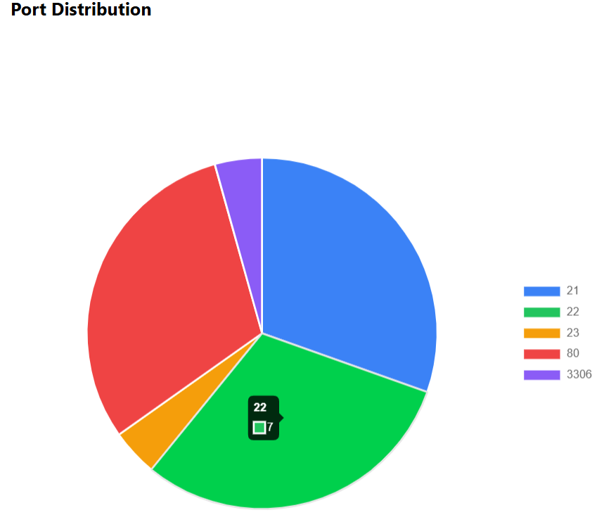

# Honey-Pot System: A Web_Based Attack Monitoring System
The Honey-Pot system creates the fake ports and once the attacker uses these ports, the attacker's IP address and time of attack is recorded.
These attacker's information is displayed using tables, line graphs and pie chart. 
**Tools and Platforms:**  
1. Programming language: JavaScript
2. Backend: Node.js
3. Frontend: React.js
4. Database: PostgreSQL
5. IDE: Visual Studio Code
**System Workflow:**  
The fake ports are activated. This project uses five different types of ports **[21, 22, 23, 80, 3360]**. The ports are activated via listener.js which is reffered to as a honeypot. 
The backend processes these attacks and store it in database (PostgreSQL). It also fetches data to the front end. 
**Outputs:**  
1. Total numbers of Attacks.
2. Filter by port.
3. Table representation of recent attack.
4. Live attack feed.
5. Line Graph and Pie Chart
6. Recent Date and Time of attack
7. Status of Database
# Output Images

Home Page

  

Web Attack Monitoring Page

  

Dashboard

  

Live Attack Section

  

Recent Attack Section

  

Line Graph

  

Pie Chart

